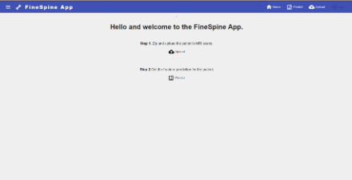
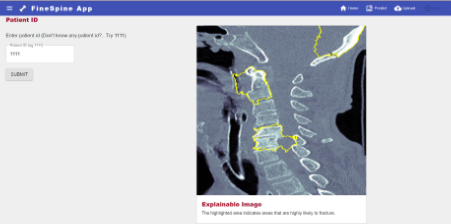
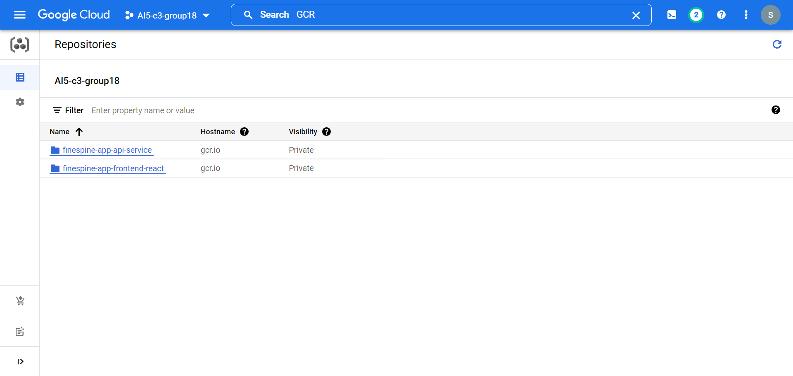
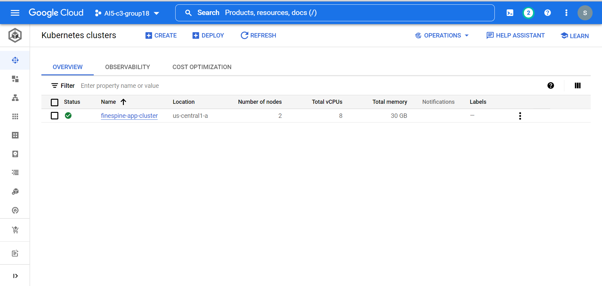

# FineSpine App
**App Description** - A tool to help doctors and technicians detect cervical spine fractures.

**Project Demo** - [Watch the video](https://drive.google.com/file/d/1LHlq5xmMECCA2f9YG_79I9gCKJal-VPA/view) </br>
**Presentation** - [click here](https://github.com/KeenBean024/FineSpine-App/blob/main/Spine_fracture_detection.pdf)
## App Screens
| Home Screen | Prediction |
| ------------- | ------------- |
|   |   |


## Getting Started
### Using the App
* **Step 1:** Upload zip file of a patients MRI scan in .dcm format. Note the patientID
* **Step 2:** Enter the patientID to get the explainable saggital view of the scan image.

### Deployment

1. **Create Service accounts**- 

    We need two GCP service accounts for the app, one for accessing the GCP storage bucket and the other for deploying the services automatically to Google Kubernetes Engine
    - Setup bucket-reader GCP service account -
        * To setup a service account you will need to go to GCP Console, search for "Service accounts" from the top search box. or go to: "IAM & Admins" > "Service accounts" from the top-left menu and create a new service account called "bucket-reader".
        * For "Service account permissions" select "Cloud Storage" > "Storage Object Viewer". Then click done.
        This will create a service account
        * On the right "Actions" column click the vertical ... and select "Create key". A prompt for Create private key for "bucket-reader" will appear select "JSON" and click create. This will download a Private key json file to your computer. Copy this json file into the secrets folder.
        * Rename the json key file to bucket-reader.json
    - Setup deployment GCP service account -
        * Go to GCP Console, search for "Service accounts" from the top search box. or go to: "IAM & Admins" > "Service accounts" from the top-left menu and create a new service account called "deployment"
        * For deployment provide the following permissions:
            * Compute Admin
            * Compute OS Login
            * Container Registry Service Agent
            * Kubernetes Engine Admin
            * Service Account User
            * Storage Admin
        * On the right "Actions" column click the vertical ... and select "Create key". A prompt for Create private key for "deployment" will appear select "JSON" and click create. This will download a Private key json file to your computer. Copy this json file into the secrets folder.
        * Rename the json key file to deployment.json
    - Place these json files in the /secrets file

2. Build containers and push to Google Container Registry
    * Sign up in Docker Hub and create an Access Token
    * Open a new terminal
    * Login to the Hub: docker login -u <USER NAME> -p <ACCESS TOKEN>
3. Setup deployment container -
    - Change the GCP_PROJECT and GCP_ZONE environment variables in the docker-shell.bat and docker-shell.sh file in `deployment` folder
    - Run `sh docker-shell.sh` or `docker-shell.bat` for windows
    - Check versions of tools
    `gcloud --version`
    `kubectl version`
    `kubectl version --client`
4. Build and Push Docker Containers to GCR
    **This step is only required if you have NOT already done this**
    ```
    ansible-playbook deploy-docker-images.yml -i inventory.yml
    ```
5. Deploy to Kubernetes Cluster
    We will use ansible to create and deploy the finespine app into a Kubernetes Cluster
    ```
    ansible-playbook deploy-k8s-cluster.yml -i inventory.yml --extra-vars cluster_state=present
    ```
6. [Optional] Explore deployed cluster
    ```
    kubectl get all
    kubectl get all --all-namespaces
    kubectl get pods --all-namespaces
    ```

    ```
    kubectl get componentstatuses
    kubectl get nodes
    ```
    ```
    kubectl get pods --namespace=mushroom-app-cluster-namespace
    kubectl get pod api-5d4878c545-47754 --namespace=mushroom-app-cluster-namespace
    kubectl exec --stdin --tty api-5d4878c545-47754 --namespace=mushroom-app-cluster-namespace  -- /bin/bash
    ```
7.  View the App
    * Copy the `nginx_ingress_ip` from the terminal from the create cluster command
    * Go to `http://<YOUR INGRESS IP>.sslip.io`
8. Delete Cluster
    ```
    ansible-playbook deploy-k8s-cluster.yml -i inventory.yml --extra-vars cluster_state=absent
    ```

## Results
### 3. Containers in Google Container Registry

### 1. Google Kubernetes Engine output



